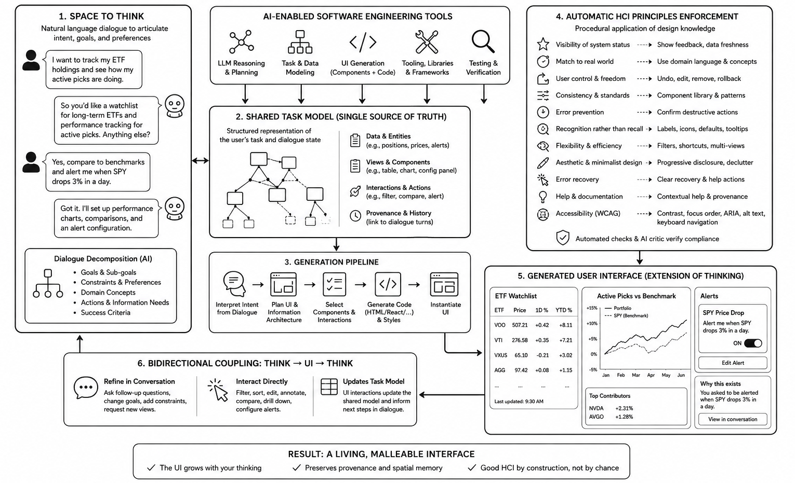

# hci-design

Included [Claude Agent Skills](https://docs.claude.com/en/docs/agents-and-tools/agent-skills) that encode established human-computer interaction (HCI) research as hard, machine-checkable constraints on *on-demand, AI-generated user interfaces*. They are a working implementation of ideas from the research paper **"Automating the Application of HCI Principles: Skills for On-Demand UI Construction, the Human-AI Space to Think, and the Future of HCI"** (Nathan Conklin, Miranda Capra, and Chris North; accepted to the FutureHCI '26 workshop).

## The research idea: HCI knowledge as executable skills

HCI is shifting away from a regime where a human designer anticipates a task and ships a fixed interface, toward a regime where an LLM generates a working UI on demand, live, inside a conversation. Once UI generation is automated, classical HCI design knowledge (Nielsen's heuristics, Norman's affordance prescriptions, WCAG accessibility criteria, cognitive-load theory, mixed-initiative principles, direct manipulation) can be encoded as **skills** — machine-readable `skill.md` files the generating agent loads at runtime — so that usability, accessibility, and consistency become properties of the *generation process* rather than something audited into a finished product after the fact.

These skills support an agentic **"Space to Think"**: a shared, structured, persistent cognitive workspace where a user and an AI collaboratively decompose a task through dialogue, and the resulting UI is generated as an extension of that thinking rather than as a separate artifact produced at the end. `diagram.png` lays out the full framework as a six-panel cycle:

1. **Space to Think** — natural-language dialogue decomposes the user's intent into goals, sub-goals, constraints, domain concepts, and success criteria (e.g., a user asking to track ETF holdings and get price-drop alerts).
2. **Shared task model** — the single source of truth: structured data/entities, views/components, interactions/actions, and provenance links back to the dialogue turns that justified them.
3. **Generation pipeline** — interpret intent → plan UI/information architecture → select components/interactions → generate code → instantiate the UI.
4. **Automatic HCI principles enforcement** — the skills library (see below) applies Nielsen's heuristics, accessibility, and related constraints procedurally to every generated component, verified by automated checks and an AI critic pass.
5. **Generated user interface** — the resulting dashboard is presented as "an extension of thinking": e.g., an ETF watchlist table, a performance chart, an alert configuration panel, and a "Why this exists" provenance link back to the conversation.
6. **Bidirectional coupling (Think → UI → Think)** — the user can refine the UI through further conversation or by interacting with it directly (filter, sort, edit, configure); either path updates the shared task model and feeds back into the dialogue.

The stated result: "a living, malleable interface" where good HCI is a property of construction, not chance.

This folder implements a small library of skills that a generating agent invokes during UI generation.

| Skill | Status | What it encodes |
|---|---|---|
| `heuristics-nielsen.skill.md` | **In this folder** | Nielsen's ten usability heuristics as a generator checklist (visible feedback, domain-matched vocabulary, reversible actions, recognizable controls, consistent component library, etc.). |
| `accessibility-wcag.skill.md` | **In this folder** | WCAG 2.2 success criteria as hard invariants (contrast, focus order, ARIA roles, alt text, keyboard reachability) — a generator invariant, not a release-time audit. |
| `affordances-norman.skill.md` | **In this folder** | Norman's affordance/signifier prescription: a control's visual form must signal its real action (pressable buttons, draggable handles, editable-looking fields), enforced at the component-library level. |
| `ability-based-personalization.skill.md` | **In this folder** | Per-user accommodations above the WCAG floor (in the tradition of SUPPLE): larger targets, longer dwell, simpler gestures, amplified contrast, plain-language labels, step-by-step disclosure — driven by a user profile, uniquely possible because each UI is generated per-user. |
| `cognitive-load-progressive-disclosure.skill.md` | **In this folder** | A minimum-sufficient-surface policy: expose only the affordances the dialogue has so far justified; new capability appears only when the user's articulated need entails it. |
| `mixed-initiative.skill.md` | Proposed, not yet present | Horvitz's mixed-initiative principles applied to agentic UI actions: every action affecting the world carries confirmation, reversibility, an audit trail, and a visible confidence signal. |
| `direct-manipulation.skill.md` | **In this folder** | Shneiderman's three direct-manipulation criteria (visible objects of interest, rapid reversible incremental actions, object manipulation over command syntax) applied to each component. |

## Use cases

- Ensuring  AI-generated user interfaces (dashboards, forms, charts, alert builders, etc.) meet baseline usability and accessibility standards automatically, without a separate human design/audit pass.
- Auditing an existing generated UI for Nielsen-heuristic or WCAG violations and getting a concrete list of failing components with proposed fixes, each traceable to a specific heuristic or success criterion.
- Serving as the reference implementation accompanying the conceptual FutureHCI research agenda: a runnable, inspectable, version-controlled artifact of HCI design knowledge, contributed by the HCI community itself, rather than a checklist in a paper hoping to influence practitioners.
- A starting point for extending the library with the remaining proposed skills (affordances, personalization, progressive disclosure, mixed-initiative, direct manipulation) as they are authored.
